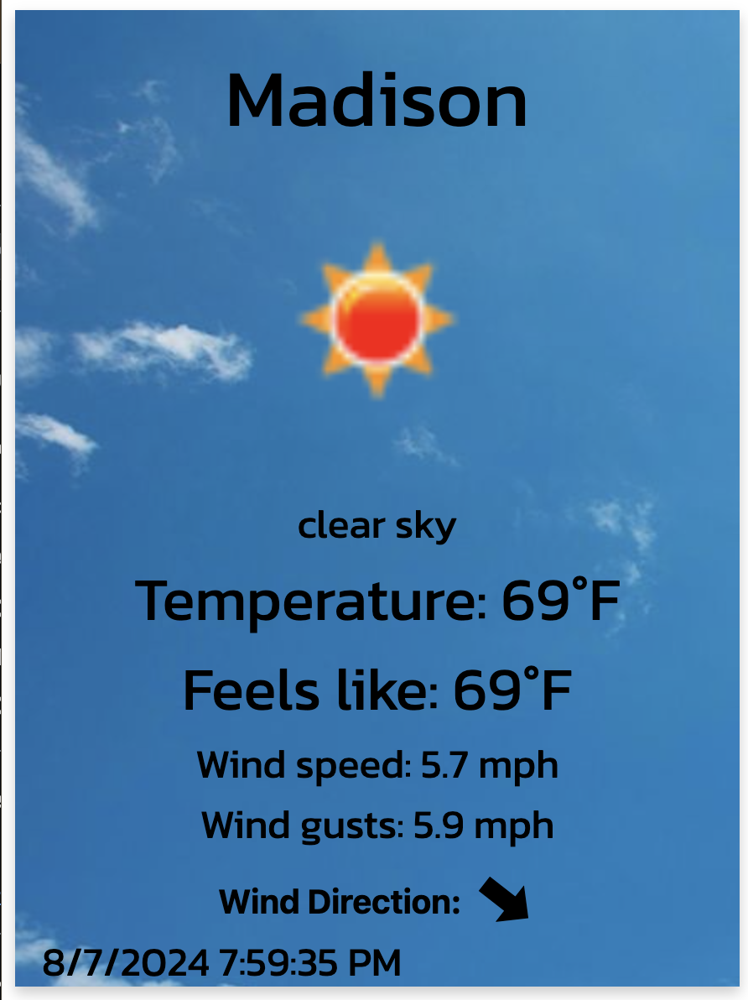
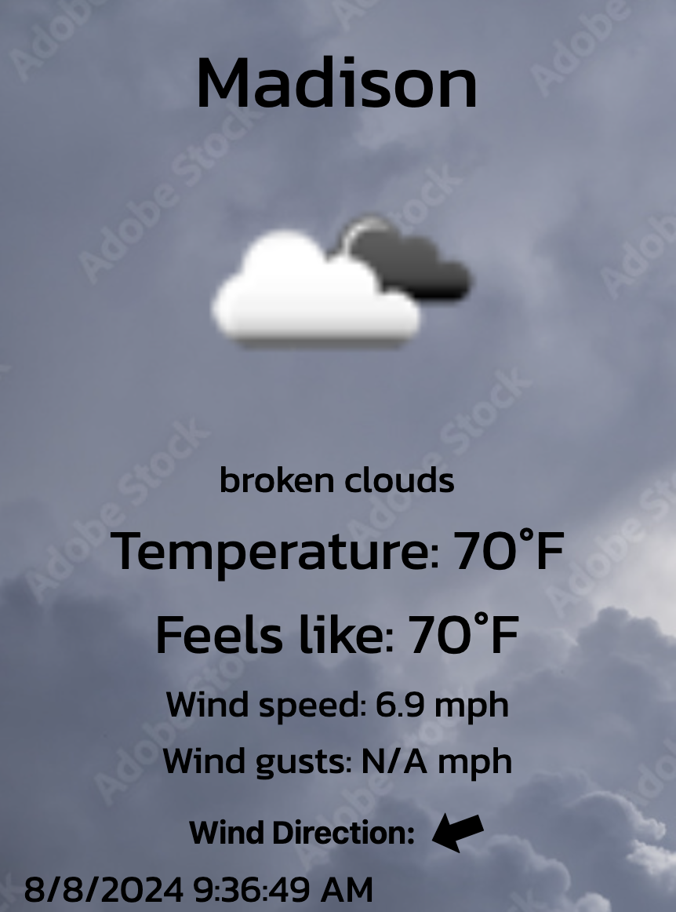
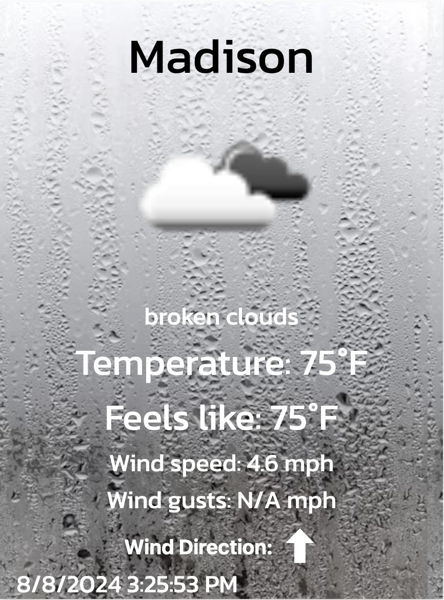
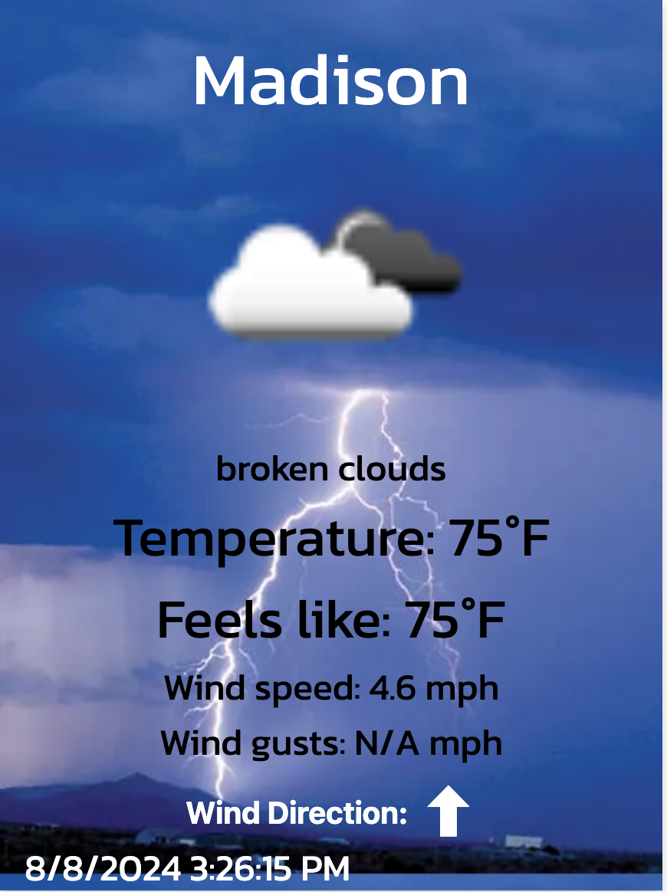

This repository contains the code for my google chrome real time weather extension. It utilizes the Openweather API to give the user real time weather, feels like weather, wind speed and wind gust as well as the wind direction. The background of the app updates based upon the weather which is shown below with some photos of the extension. (Apologies about inconsisent weather description and icons, I manipulated the backgrounds in order to see what each one looks like).

**Clear and Sunny weather:**

**Cloudy and Broken clouds weather:**

**Rainy weather:**

**Thunderstorm weather:**

